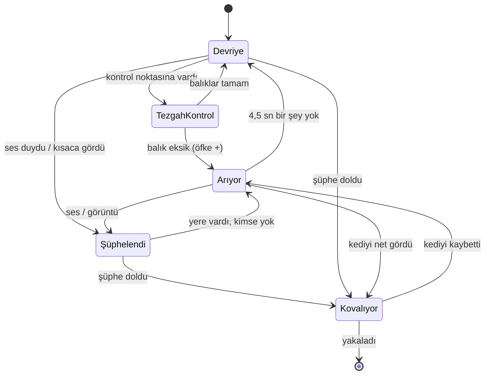

# Kaçak Pati — AI Co-Designer ile 60 Dakikada Oyun Tasarımı

> **Tek cümlede oyun:** Aç bir sokak kedisisin. Balıkçı Rıza'nın pazarından balık çalıp yakalanmadan kaçmalısın.
>
> Oynanabilir prototip: [`oyun/index.html`](oyun/index.html). Tarayıcıda açman yeterli.

---

## 1. AI'ya Oyun Fikri Ver (10 dk)

**Verdiğimiz fikir (prompt):**
> "Pazarda balık çalan bir kedi hakkında basit, tek ekranlık, yukarıdan bakışlı bir gizlilik oyunu yapmak istiyoruz. Olası mekanikleri, oyuncu hedeflerini ve tasarım sorunlarını öner."

### AI'nın önerdiği mekanikler ve değerlendirmemiz

| # | AI önerisi | Değerlendirme | Neden |
|---|---|---|---|
| 1 | Sandıkların arkasına saklanma (görüşü kesen engeller) | ✅ **Faydalı** | Gizlilik oyununun çekirdeği. Haritayı bir bulmacaya çeviriyor. |
| 2 | Koş / sinsi yürü: koşmak ses çıkarır, sinsi yürümek yavaştır | ✅ **Faydalı** | Her saniye bir risk/ödül kararı getiriyor. |
| 3 | Balıkçı çalındıkça daha dikkatli olur | ✅ **Faydalı** | Oyun kendiliğinden zorlaşıyor ve oyuncu eyleminin sonucunu görüyor. |
| 4 | Farklı balık türleri, farklı puanlar | ⚪ **Jenerik** | Her oyuna yapıştırılabilecek bir fikir. Bu prototipe bir şey katmıyor. |
| 5 | Gündüz/gece döngüsü | ⚪ **Jenerik** | Kulağa hoş geliyor ama 2 dakikalık bir bölümde hissedilmez. |
| 6 | Kombo ve puan çarpanı | ⚪ **Jenerik** | Gizlilikle çelişiyor, oyuncuyu acele etmeye itiyor. |
| 7 | Kedi için yetenek ağacı (tırmanma, çift zıplama) | ❌ **Uygunsuz** | Yukarıdan bakışlı 2D harita ve 60 dakikalık kapsamla uyuşmuyor. |
| 8 | Diğer kedilerle çevrimiçi çok oyunculu mod | ❌ **Uygunsuz** | Kapsamı büyütüyor. Gizlilik tek kişilik bir gerilim. |

### Oyuncu hedefleri (AI önerisi, bizim seçimimiz)
- **Ana hedef:** En az 5 balık çal ve ÇIKIŞ'a ulaş.
- **Ustalık hedefi:** 8 balığın hepsini Rıza'yı hiç kovalamaya geçirmeden al.

### AI'nın işaret ettiği tasarım sorunları
- Kedi çok hızlıysa gerilim olmaz, çok yavaşsa oyun sinir bozucu olur.
- Balıkçı "her şeyi görürse" oyun haksız hissettirir.
- Oyuncu her zaman sinsi yürümeyi seçebilir. O zaman "koş" seçeneği anlamsızlaşır.

---

## 2. NPC Tasarımı: Balıkçı Rıza (15 dk)

Rıza'yı AI'ya birkaç turda adım adım geliştirttik:

| Tur | Prompt | AI'nın çıktısı | Sorun / sonraki adım |
|---|---|---|---|
| v1 | "Bir NPC oluştur." | "Rıza pazarda dolaşır, kediyi görünce kovalar." | Çok belirsiz. **Nasıl** gördüğü tanımlı değil. |
| v2 | "Neyi, nasıl algılıyor?" | Görüş konisi (açı + menzil) ve duyma yarıçapı | Duvarın arkasını görüyor mu? → Görüş hattı (raycast) eklendi. |
| v3 | "Kediyi kaybedince ne yapıyor?" | Son bilinen konumu hatırlar, oraya gider, etrafa bakar | Anında "her şeyi bilen" NPC olmaktan çıktı. Adil hissettiriyor. |
| v4 | "Oyuncunun eylemlerine nasıl tepki verir?" | Tezgahlarını kontrol eder, eksik balık görünce öfkelenir | Oyunun zamanla zorlaşması ve "sinsi hep en iyisi" sorununun çözümü. |
| v5 | "Oyuncu Rıza'nın ne düşündüğünü nasıl anlar?" | Konuşma balonları, `?` / `!` işaretleri, renk değiştiren görüş konisi | Oyuncuya geri bildirim. Yakalanınca "neden?" sorusu kalmıyor. |

### Algı → Karar → Eylem

| **Algı** (ne perceive ediyor) | **Karar** (durum makinesi) | **Eylem** (ne yapıyor) |
|---|---|---|
| Görüş konisi: ~75°, 200 px. Sandık ve duvarlar görüşü keser, tezgahlar kesmez. | **Devriye:** sabit rota. Kontrol noktalarında durup balık sayar. | Yürür (yavaş). |
| Çok yakınsa (42 px) arkasını da sezer. | **Şüphelendi:** kısa süre gördü ya da ses duydu. | Sese/görüntüye döner, oraya yürür, "Bu ses de ne?" der. |
| Ses: koşan kedi 150 px, balık kapma 110 px yarıçapında ses yapar. Sinsi yürüyüş sessizdir. | **Kovalıyor:** şüphe ölçeği doldu. | Koşar (BFS yol bulma), "HEY! Gel buraya pisi!" diye bağırır. |
| Hafıza: kediyi son gördüğü konum ve zaman. | **Arıyor:** kediyi kaybetti ya da balık eksik buldu. | Son konumda durup 4,5 sn boyunca etrafa bakar. |
| Tezgah kontrolü: yakınındaki eksik balıkları fark eder. | **Öfke** (0–3): her eksik balık için +1. | Görüş +25 px, koşu hızı +8, fark etme hızı +%20 (öfke başına). |

**Şüphe ölçeği:** Kediyi gördükçe dolar. Kedi yakınsa daha hızlı dolar, sinsi yürüyorsa yavaş dolar. Görmediğinde yavaşça boşalır. Böylece Rıza "tek karede görüp yakalayan" bir NPC olmuyor, oyuncuya tepki verecek zaman kalıyor.

---

## 3. AI'yı Kır (10 dk)

**Prompt:** "Oyuna her turda 3 yeni mekanik daha ekle, daha eğlenceli ve derin olsun."

| Tur | AI'nın eklediği | Tasarımın durumu |
|---|---|---|
| 1 | Bekçi köpeği, güçlendirmeler (hız balığı), süre sınırı | Hâlâ gizlilik oyunu, biraz kalabalık. |
| 2 | Balıklardan yemek yapma (crafting), balıkçıyla pazarlık/ekonomi, kedi kostümleri | **Hedef kaymaya başladı:** çalıyor muyuz, ticaret mi yapıyoruz? |
| 3 | Açık dünya İstanbul, hikaye modu, NPC'lerle ilişki sistemi, hava durumu | Pazar artık sadece bir bölge. Rıza önemsizleşti. |
| 4 | Sezon kartı (battle pass), çevrimiçi PvP, dev martı boss savaşı, kedi köyü inşası | Artık bambaşka 4 oyunun karışımı. |

### Tespit ettiğimiz sorunlar
- **Feature creep:** AI hiçbir turda "bu kadarı yeter" demedi. Her istekte "evet, ve…" diyerek ekleme yaptı.
- **Gereksiz sistemler:** Crafting, ekonomi, kostüm ve inşa sistemlerinin hiçbiri gizlilik gerilimini artırmıyor.
- **Net bir oyuncu hedefi yok:** 4. turdan sonra "oyunda ne yapıyorum?" sorusuna tek cümlelik bir cevap verilemiyor.
- **Çekirdek NPC eridi:** En ilginç sistem Rıza'nın beyniydi. Eklenen her şey onu arka plana itti.

**Aldığımız kural:** Her mekanik ya **saklanmayla** ya da **Rıza'nın algısıyla** ilgili olmalı. Bu filtreden geçmeyen her şey kesildi. 4 turdan elde kalan: *yok*. Hepsi kesildi. (Bekçi köpeği "ikinci bölüm" fikri olarak not edildi.)

---

## 4. AI'yı Eleştirmen Olarak Kullan (10 dk)

AI'ya kendi tasarımımızı (bölüm 2'deki tablo + harita) verip "potansiyel sorunları bul" dedik.

| # | AI'nın eleştirisi | Karar | Gerekçe |
|---|---|---|---|
| 1 | Oyuncu Rıza'nın ne düşündüğünü göremezse yakalanmak haksız hissettirir. | ✅ **Kabul** | Renk değiştiren koni, `?`/`!`, konuşma balonları ve **H** ile açılan "AI beyni" paneli eklendi. |
| 2 | Sinsi yürümek her zaman en güvenli seçenek olursa koşmak anlamsızlaşır. | ✅ **Kabul** | Öfke sistemi zaman baskısı yaratıyor. Kedi koşunca (150) Rıza'dan (118+) hızlı, sinsi yürürken (68) yavaş. Kaçmak için ses çıkarmak gerekiyor. |
| 3 | Görüş duvarların içinden geçerse saklanmak işe yaramaz. | ✅ **Kabul** | Görüş hattı ışın taramasıyla kontrol ediliyor. Koni de öyle çiziliyor. |
| 4 | NPC köşelere takılabilir. | ✅ **Kabul** | Izgara üzerinde BFS yol bulma. Her 0,3 sn'de yol yeniden hesaplanıyor. |
| 5 | Tek yakalanmada oyunun bitmesi çok sert bir ceza. | ❌ **Red** | Bölüm 1–2 dakika sürüyor ve **R** ile anında yeniden başlıyor. Can sistemi gerilimi azaltır. |
| 6 | Hikaye zayıf: kedi neden balık çalıyor? | ❌ **Red** | "Aç kedi + balık" fantezisi kendini anlatıyor. Prototipte hikayeye süre harcamıyoruz. |
| 7 | Tek NPC sıkıcı, daha fazla balıkçı ekleyin. | ❌ **Red** | Kapsam büyür. Amacımız tek bir NPC'yi iyi tasarlamak. |
| 8 | Ses duvarlardan etkilenmiyor, bu gerçekçi değil. | ❌ **Red (şimdilik)** | Oyuncunun kafasındaki kural basit kalsın: "koşarsan duyar". Sonraki sürüm için not edildi. |

**Gözlem:** AI'nın eleştirileri iki gruba ayrıldı. Oyuncu deneyimine dayananlar (1–4) çok değerliydi. Genel "oyunlarda olması gerekenler" listesinden gelenler (5–7) bizim hedefimizi bilmediği için yanlıştı.

---

## 5. AI Oyun Konseptimiz (15 dk)

| | |
|---|---|
| **Oyun fikri** | Tek ekranlık, yukarıdan bakışlı gizlilik oyunu. Kedi pazardan en az 5 balık çalıp çıkışa kaçar. |
| **Oyuncu deneyimi** | Gerilim → rahatlama döngüsü: koninin kenarından sıyrılmak, sesi duyulunca donup kalmak, kovalamacadan sandıkların arkasına dalıp kurtulmak. Rıza'nın sözleriyle mizahi bir ton. |
| **AI sistemi** | Balıkçı Rıza. Durum makinesi + şüphe ölçeği + hafıza + öfke. |
| **AI ne algılıyor?** | Görüş konisi (duvar/sandık keser), ses yarıçapı (koşma, balık kapma), kedinin son bilinen konumu, tezgahlardaki eksik balıklar. |
| **Hangi kararları veriyor?** | Devriye / Tezgah kontrolü / Şüphelen / Kovala / Ara geçişleri. Kediyi ne kadar hızlı fark edeceği. Öfkelenip zorlaşıp zorlaşmayacağı. |
| **Hangi eylemleri yapıyor?** | Yürür/koşar (BFS yol bulma), başını çevirir/etrafı tarar, konuşur, yakalar. |

### AI ne kattı, biz neye karar verdik?

| AI'nın katkısı | Tasarımcıların kararı |
|---|---|
| Çok sayıda mekanik önerisi (bölüm 1) | Hangilerinin kalacağını seçmek: 8 öneriden 3'ü kaldı. |
| NPC'nin algı/karar/eylem yapısını hızlıca çıkarmak | "Rıza her şeyi bilmesin, hafızası olsun" ilkesi ve şüphe ölçeğinin varlığı |
| Durum makinesi taslağı ve prototip kodu | Hız, menzil ve yarıçap sayıları (oynayarak ayarlandı) |
| Eleştiri listesi (bölüm 4) | Hangi eleştirinin kabul, hangisinin red edileceği |
| Sınırsız özellik fikri (bölüm 3) | Kapsam kuralı: "saklanma ya da Rıza'nın algısıyla ilgili değilse kes" |
| Diyalog satırları | Oyunun tonu: gerilimli ama komik |

---

## Final Tartışma (5 dk)

**AI neye yaradı?**
- Hızlı beyin fırtınası: 1 dakikada 8 mekanik. Boş sayfa sorunu yok.
- Uç durumları hatırlatmak ("duvarın arkasını görür mü?", "kaybedince ne olur?").
- Eleştirmen rolü: özellikle oyuncu algısıyla ilgili sorunları yakalamakta iyiydi.
- Prototip kodunu hızlıca yazıp fikri **oynanabilir** hale getirmek.

**Nerede zorlandı?**
- **Hayır diyemedi:** İstendiği sürece özellik ekledi. Kapsamı koruyan hiçbir iç fren yok.
- **Jenerik öneriler:** Önerilerin bir kısmı her oyuna uyacak kalıplardı (puan, gündüz/gece, kostüm).
- **Bağlamı bilmiyor:** "Can sistemi ekle" gibi eleştiriler bizim hedefimizi (kısa, gergin bölüm) bilmediği için yanlıştı.
- **Eğlenceyi hissedemiyor:** Sayıların (hız 118 mi 130 mu?) doğru olup olmadığını ancak oynayarak bulabiliyoruz.

**Oyun tasarımında AI'nın rolü:**
AI hızlı bir **üretici** ve dikkatli bir **eleştirmen**. Ama **yön**, **odak** ve **kesme** kararları tasarımcıya ait. AI seçenekleri çoğaltıyor, tasarımcı seçiyor. Ayrıca AI'yı oyunun *içinde* kullandığımızda da (Rıza) aynı ilke geçerli: iyi bir oyun AI'ı "en akıllı" olan değil, oyuncunun **okuyabildiği** ve **alt edebildiği** AI.
